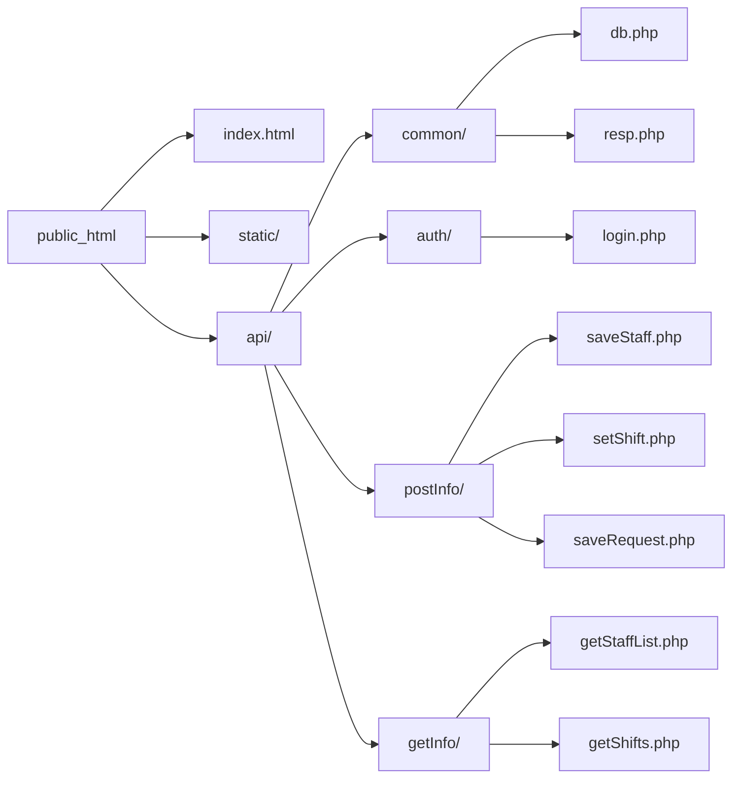

# ディレクトリ構成 (public_html/)

```mermaid
graph LR
  A[public_html]
  A --> B[index.html]
  A --> C[static/]
  A --> D[api/]
  D --> E[common/]
  E --> E1[db.php]
  E --> E2[resp.php]
  D --> F[auth/]
  F --> F1[login.php]
  D --> G[postInfo/]
  G --> G1[saveStaff.php]
  G --> G2[setShift.php]
  G --> G3[saveRequest.php]
  D --> H[getInfo/]
  H --> H1[getStaffList.php]
  H --> H2[getShifts.php]
```