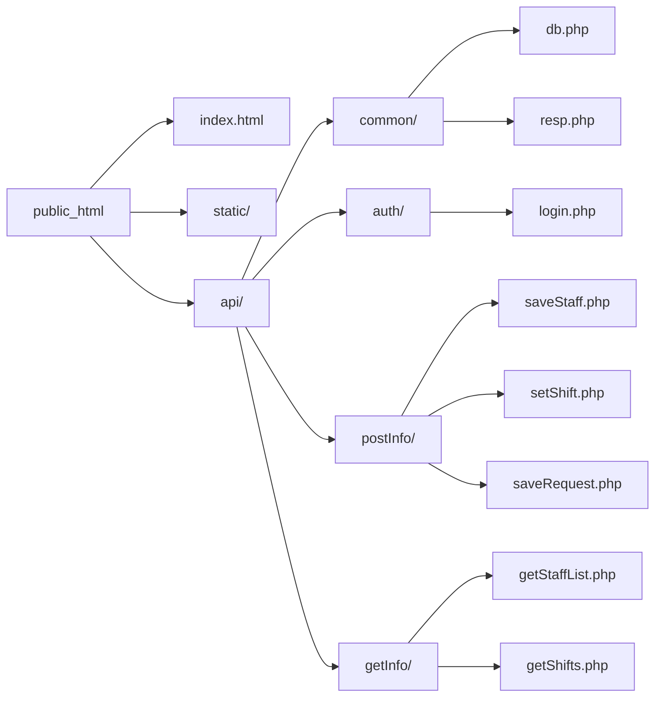

# シフト管理ツール 統合要件定義書

## 1. プロジェクト概要
- **名称**: SS-Shift (Simple Star-Shift)
- **構成**: フロントエンド（React）とバックエンド（PHP）をAPIで結合する疎結合アーキテクチャ。
- **インフラ**: スターサーバー（無料版・広告非表示環境）
- **技術スタック**: 
  - **フロント**: React / MUI (Material UI) / React Router
  - **バックエンド**: PHP 8.5.2 (Vanilla PHP)
  - **データベース**: MySQL (MariaDB 10.5)

## 3. 要件定義

### 3.1 技術要件
- **技術スタック**:
  - **フロント**: React / MUI (Material UI) / React Router
  - **バックエンド**: PHP 8.5.2 (Vanilla PHP)
  - **データベース**: MySQL (MariaDB 10.5)

### 3.2 非機能要件
1. **コスト管理**: クレジットカード未登録での運用を前提とし、リソース超過時は自動停止による課金回避を徹底する。
2. **アーキテクチャ**: フロントとバックをAPI通信のみで疎結合化。将来的にフロント（Vercel等）とバック（別サーバー）を物理的に切り離せる「3層構成」に対応可能な設計とする。
3. **API統制**: 通信メソッドと役割に基づき、`getInfo/` (取得: GET) と `postInfo/` (更新・登録: POST) で物理的にディレクトリを分離管理する。
4. **環境管理**: DB接続設定 (`db.php`) 等の環境依存情報は一箇所に集約し、保守性を高める。

## 4. 機能要件

### A. 認証機能 (auth/)
- **フロント**: ログインフォーム。セッション維持を確認する `checkAuth` 機能を実装。
- **バック**: `login.php` にて照合。PHP Native Session (`HttpOnly` Cookie) による状態保持。
- **要件**: 共通認証チェック処理を独立させ、将来的なトークン認証（JWT等）への移行を容易にする。

### B. スタッフ管理機能 (staff)
- **フロント**: 一覧表示、新規登録・編集用モーダル。
- **バック**: `getInfo/getStaffList.php`、`postInfo/saveStaff.php`。
- **要件**: 責任者および管理者権限のユーザーのみが実行可能なアクセス制御の実装。

### C. シフト作成・カレンダー機能 (shift)
- **フロント**: 動的カレンダーUI。レスポンシブ設計により、PC時はグリッド、スマホ時はリスト形式（アジェンダビュー）へ自動切替。分単位で時間を入力可能。JIRA風のタイムライングラフで各登録者のシフト時間を確認。
- **バック**: `getInfo/getShifts.php`、`postInfo/setShift.php`。
- **要件**: 勤務時間の重複バリデーション、月次・週次データの範囲指定取得。

### E. 帳票出力機能 (output)
- **フロント**: シフト確定データのダウンロード実行。
- **バック**: `postInfo/generateExcel.php`。PHPによるExcelバイナリデータのストリーム出力。

## 6. 追加設計: API仕様
全APIは `api/` 配下で動作。JSON入出力で統一。

- GET `/api/getInfo/getStaffList.php`
  - req: header `Authorization` (セッション Cookie)
  - resp: `[{id, name, role_name, active}, ...]`

- GET `/api/getInfo/getShifts.php` 
  - req: `startDate`, `endDate`, `staffId?`
  - resp: `[{id, staffId, date, startTime, endTime, note}, ...]`
  - 要件: 参照可能期間を「当月から前後2ヶ月」と制限（例: 4月なら2〜6月）

- POST `/api/postInfo/saveStaff.php`
  - req: `{id?, name, role, email, password?}`
  - resp: `{success: true, id: ...}`

- POST `/api/postInfo/setShift.php`
  - req: `{id?, staffId, date, startTime, endTime, memo}`
  - validation: 開始<終了、重複禁止

- POST `/api/auth/login.php`
  - req: `{email, password}`
  - resp: `{success: true, user: {id, name, role}}`

## 7. 追加設計: DB設計
- `roles`
  - id PK
  - name VARCHAR(50) UNIQUE (例: '一般', '責任者', '管理者')
  - created_at TIMESTAMP

- `users`
  - id PK
  - name VARCHAR
  - email UNIQUE
  - password_hash
  - role_id FK->roles(id)
  - is_active TINYINT
  - created_at, updated_at

- `shifts`
  - id PK
  - staff_id FK->users(id)
  - date DATE
  - start_time TIME
  - end_time TIME
  - memo TEXT
  - manager_checked TINYINT (0・1)
  - manager_id NULLABLE FK->users(id)
  - created_by
  - updated_by
  - created_at, updated_at
  - UNIQUE(staff_id, date, start_time, end_time)

## 8. 追加設計: フロント画面とルーティング
React Router v6 で画面遷移を構成。
- `/login` → `LoginPage`
- `/staff` → `StaffListPage` (管理者)
- `/shift` → `ShiftCalendarPage`
- `/report` → `OutputPage`

MUI推奨コンポーネント
- `AppBar`, `Drawer`, `DataGrid`, `DatePicker`, `TimePicker`, `Modal`, `Button`, `TextField`

## 9. 追加設計: バリデーション / セキュリティ
- サーバー側で必ず実施
  - ログイン済みチェック
  - 管理者権限／自身権限
  - シフト時間重複と同一スタッフ日付重複
  - 期限制約（未来日付制限など）
- セキュリティ
  - CSRF: SameSite Cookie +リクエストトークン
  - XSS: 出力時エスケープ（フロントも）
  - SQLi: PDOプレースホルダ

## 10. 追加設計: 勤怠・給与機能追加
- 有休管理
  - `paid_leaves` テーブル: `id`, `staff_id`, `year_month`, `allocated_hours`, `used_hours`, `remaining_hours`
  - フロント: 月別残有休表示、取得申請（管理者承認ワークフローは将来拡張）
  - backend API: `getInfo/getPaidLeave.php`, `postInfo/updatePaidLeave.php`

- 出勤時間集計
  - `getInfo/getWorkSummary.php` (月次/週次)
    - req: `staffId`, `startDate`, `endDate`
    - resp: `{totalHours, overtimeHours, nightHours(optional), shiftCount}`
  - 計算ロジック
    - `totalHours = Σ(end-start)`
    - `overtimeHours = max(0, totalHours - standardHours)` (例: 160h/月)

- 給与計算機能（簡易）
  - `salary_settings` テーブル: `id`, `staff_id`, `base_hourly_rate`, `overtime_multiplier`, `allowance`, `tax_rate`
  - `getInfo/getSalaryEstimate.php`
    - req: `staffId`, `yearMonth`
    - 内部: `workSummary` 取得 → `salary = base * totalHours + base * overtime_multiplier * overtimeHours + allowance` → `net = salary * (1 - tax_rate)`
    - resp: `{grossSalary, tax, netSalary, totalHours, overtimeHours}`
  - フロント: 今月の出勤時間表示、給与見積表示、不整合アラート

- 関連UIページ追加
  - `/timesheet` → `TimesheetPage` (日次・週次・月次集計)
  - `/paidleave` → `PaidLeavePage`
  - `/payroll` → `PayrollPage`（給与計算・支給明細）

## 11. 追加設計: テスト
- 単体: Jest/Vitest (フロント), PHPUnit (バック)
- E2E: Playwright (ログイン→シフト登録→勤怠集計→給与計算)
- API: Postman / Swagger test

## 12. ディレクトリ構成 (public_html/)

